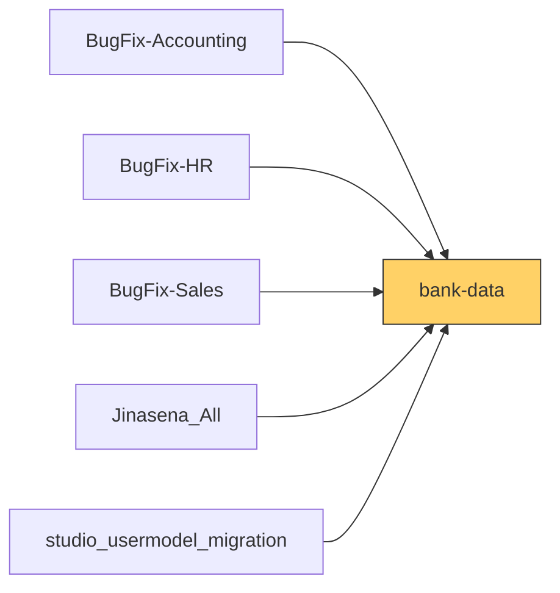

# Functional Documentation — bank-data

> Generated by `scripts/generate_functional_docs.py` from branch `Visual_Migration_02` (commit 001188d 2026-10-01) and the installed module on the clean environment. For every attribute: **Function** = what it does, **Depends on** = the attributes it relies on (owning module in brackets when it is not this repo), **Used by** = the attributes in any Jinasena repo that rely on it.

| Item | Value |
|---|---|
| Technical name | `bank-data` |
| Title | Jinasena : SubModule : Payroll : Bank Data |
| Version | `17.0.1.0.9` |
| Category | Payroll |
| License | LGPL-3 |
| Installed on environment | installed 17.0.1.0.9 |
| History | [CHANGELOG.md](CHANGELOG.md) |

## Purpose

<!-- SUMMARY:repo -->
This module supports the payroll team in paying salaries by bulk bank transfer through the Commercial Bank of Sri Lanka (CBC) Paymaster / SLIPS service. It stores the bank codes the transfer file needs (a 4-digit MICR code per bank and a 3-digit branch code per bank account), keeps one configuration record with Jinasena's originating account and the file format constants, and produces the transfer file in two ways: a wizard that writes a fixed-width .dat file with 151-character records, and an XLSX export of payslips in the CBC 'com_upload' layout. A Bank Data list under Payroll > Reporting shows payslips with a net wage above zero together with all Paymaster columns.

- Bank master data: MICR code and LC Limit on banks; Branch Code and SWIFT Code on bank accounts; an automation that blocks account numbers longer than 13 digits.
- CBC Paymaster Configuration: a single record with originating bank details and format codes.
- Paymaster File Generator wizard: employees, amounts, value date and reference, giving a downloadable .dat file; no menu or button opens it in this repo.
- Payslip Bank Data list with an Export Paymaster XLSX action.
- Computed Paymaster columns on journal items, shown in a Bank Data list of journal items.
- Employee Bank Accounts window action, used by a menu in studio_usermodel_migration.
- A Bank Branch model and a post_migrate function exist in the code but are not active.
<!-- /SUMMARY -->

## Module dependencies

| Kind | Modules |
|---|---|
| Odoo standard / enterprise | `account`, `hr`, `hr_payroll`, `base`, `base_automation` |
| Jinasena repos |  |
| Third-party apps |  |
| Used by (Jinasena repos that depend on this one) | `BugFix-Accounting`, `BugFix-HR`, `BugFix-Sales`, `Jinasena_All`, `studio_usermodel_migration` |



## Contents at a glance

| Attribute type | Count |
|---|---|
| Models created | 3 |
| Models extended | 4 |
| Fields | 103 |
| Python methods | 9 |
| Views | 11 |
| Window actions | 4 |
| Server actions | 2 |
| Automations | 1 |
| Menus | 1 |
| Access rights | 3 |
| Install hooks | 1 |

## Models

| Model | Description | Created / extends | Fields | Views | Actions + automations | Approvals |
|---|---|---|---|---|---|---|
| `account.move.line` | Journal Item | extends (account) | 19 | 1 | 0 | 0 |
| `hr.payslip` | Pay Slip | extends (hr_payroll) | 17 | 1 | 1 | 0 |
| `jinasena.bank.branch` |  | extends (None) | 0 | 0 | 0 | 0 |
| `jinasena.paymaster.config` | CBC Paymaster Configuration | created | 18 | 1 | 0 | 0 |
| `jinasena.paymaster.wizard` | CBC Paymaster File Generator | created | 17 | 1 | 0 | 0 |
| `jinasena.paymaster.wizard.line` | Paymaster Wizard Payment Line | created | 26 | 1 | 0 | 0 |
| `res.bank` | Bank | extends (base) | 2 | 4 | 0 | 0 |
| `res.partner.bank` | Bank Accounts | extends (base) | 4 | 2 | 2 | 0 |

### `account.move.line` — Journal Item

*Extends a model created by `account`.* Python: `models/account_move_line.py`.

Other repos that use this model: `access right BugFix-Accounting.access_6867_account_move_line` (BugFix-Accounting)<br>`account.move._bugfix_purchase_auto_reconcile_cp()` (BugFix-Purchase)<br>`account.move.line._compute_x_studio_employers_contribution()` (BugFix-Accounting)<br>`account.move.line._compute_x_studio_members_contribution()` (BugFix-Accounting)<br>`automation BugFix-Accounting.base_automation_120_srm_auto_populate_report_type_in_account_move_lines` (BugFix-Accounting)<br>`automation BugFix-Accounting.base_automation_219_update_analytic_tag_parameters_sales_invoice_line_product` (BugFix-Accounting)<br>`automation BugFix-Accounting.base_automation_239_update_analytic_tag_parameters_sales_invoice_line_account` (BugFix-Accounting)<br>`automation BugFix-Accounting.base_automation_343_etf_schedule_contract_id` (BugFix-Accounting)<details><summary>+85 more</summary>`record rule BugFix-Accounting.rule_100_readonly_move_line` (BugFix-Accounting)<br>`record rule BugFix-Accounting.rule_141_purchase_user_account_move_line` (BugFix-Accounting)<br>`record rule BugFix-Accounting.rule_174_personal_invoice_lines` (BugFix-Accounting)<br>`record rule BugFix-Accounting.rule_175_all_invoice_lines` (BugFix-Accounting)<br>`record rule BugFix-Accounting.rule_329_expense_team_approver_account_move_line` (BugFix-Accounting)<br>`record rule BugFix-Accounting.rule_636_point_of_sale_account_move_line` (BugFix-Accounting)<br>`record rule BugFix-Accounting.rule_78_entry_lines` (BugFix-Accounting)<br>`record rule BugFix-Accounting.rule_94_all_journal_items` (BugFix-Accounting)<br>`record rule BugFix-Accounting.rule_96_portal_invoice_lines` (BugFix-Accounting)<br>`record rule BugFix-Accounting.rule_98_readonly_move_line` (BugFix-Accounting)<br>`server action BugFix-Accounting.sa_f5_x_sales_report_model_srm_rpt_costing_work_sheet` (BugFix-Accounting)<br>`server action BugFix-Accounting.sa_f5_x_sales_report_model_srm_rpt_project_gross_margin` (BugFix-Accounting)<br>`server action BugFix-Accounting.server_action_1144_work_center_costing_model_update_journal_entries` (BugFix-Accounting)<br>`server action BugFix-Accounting.server_action_1370_imp_update_consignment_pi` (BugFix-Accounting)<br>`server action BugFix-Accounting.server_action_1374_imp_testing` (BugFix-Accounting)<br>`server action BugFix-Accounting.server_action_1670_rpt_daily_sales_report_generate` (BugFix-Accounting)<br>`server action BugFix-Accounting.server_action_1680_rpt_customer_wise_invoices_generate` (BugFix-Accounting)<br>`server action BugFix-Accounting.server_action_1732_srm_auto_populate_report_type_in_account_move_lines` (BugFix-Accounting)<br>`server action BugFix-Accounting.server_action_2102_srm_rpt_project_gross_margin` (BugFix-Accounting)<br>`server action BugFix-Accounting.server_action_2176_rr_rug_account_update_in_si` (BugFix-Accounting)<br>`server action BugFix-Accounting.server_action_2344_update_analytic_tag_parameters_sales_invoice_line_product` (BugFix-Accounting)<br>`server action BugFix-Accounting.server_action_2366_imp_vendor_bill_currency_rate` (BugFix-Accounting)<br>`server action BugFix-Accounting.server_action_2419_update_analytic_tag_parameters_sales_invoice_line_account` (BugFix-Accounting)<br>`server action BugFix-Accounting.server_action_2490_srm_rpt_costing_work_sheet` (BugFix-Accounting)<br>`server action BugFix-Accounting.server_action_2739_project_update_advance_payment_account` (BugFix-Accounting)<br>`server action BugFix-Accounting.server_action_2762_project_update_advance_payment_account_vendor_bill` (BugFix-Accounting)<br>`server action BugFix-Accounting.server_action_3278_execute_code` (BugFix-Accounting)<br>`server action BugFix-Accounting.srv_advance_payment_acc_update` (BugFix-Accounting)<br>`server action BugFix-Accounting.srv_imp_update_consignment_pi` (BugFix-Accounting)<br>`server action BugFix-Accounting.srv_imp_vendor_bill_currency_rate` (BugFix-Accounting)<br>`server action BugFix-Accounting.srv_rug_account_update_in_si` (BugFix-Accounting)<br>`server action BugFix-Accounting.srv_update_advance_payment_account_vendor_bill` (BugFix-Accounting)<br>`server action BugFix-Stock.server_action_1377_imp_copy_charges_to_tp_invoice` (BugFix-Stock)<br>`server action BugFix-Stock.server_action_2448_movement_journals_update_offset_account` (BugFix-Stock)<br>`server action BugFix-Studio-Misc.server_action_2799_mst_odoo_data_clean_up` (BugFix-Studio-Misc)<br>`server action BugFix-Studio-Misc.server_action_2883_mst_odoo_data_clean_up_004` (BugFix-Studio-Misc)<br>`window action BugFix-Accounting.act_window_1145_account_move_line` (BugFix-Accounting)<br>`window action BugFix-Accounting.act_window_1572_sales_invoice_lines` (BugFix-Accounting)<br>`window action BugFix-Accounting.act_window_2198_sales_invoices` (BugFix-Accounting)<br>`window action BugFix-Accounting.act_window_2278_pump_price_costing` (BugFix-Accounting)<br>`window action BugFix-Accounting.act_window_2285_pump_product_costing` (BugFix-Accounting)<br>`window action BugFix-Accounting.act_window_2371_journal_item` (BugFix-Accounting)<br>`window action BugFix-Accounting.act_window_2377_journal_item_2` (BugFix-Accounting)<br>`window action BugFix-Accounting.act_window_2378_journal_item_testing` (BugFix-Accounting)<br>`window action BugFix-Accounting.act_window_2379_journal_item_testing_02` (BugFix-Accounting)<br>`window action BugFix-Accounting.act_window_2530_aaaa` (BugFix-Accounting)<br>`window action BugFix-Accounting.act_window_2631_journal_items` (BugFix-Accounting)<br>`window action BugFix-Accounting.act_window_2737_all_journal_items` (BugFix-Accounting)<br>`window action BugFix-Accounting.act_window_2893_etf_schedule` (BugFix-Accounting)<br>`window action BugFix-Accounting.act_window_2894_epf_schedule` (BugFix-Accounting)<br>`window action BugFix-Accounting.act_window_3271_invoice_wise_revenue_report` (BugFix-Accounting)<br>`window action BugFix-Accounting.action_1145_account_move_line` (BugFix-Accounting)<br>`window action BugFix-Accounting.action_1572_sales_invoice_lines` (BugFix-Accounting)<br>`window action BugFix-Accounting.action_2198_sales_invoices` (BugFix-Accounting)<br>`window action BugFix-Accounting.action_2278_pump_price_costing` (BugFix-Accounting)<br>`window action BugFix-Accounting.action_2285_pump_product_costing` (BugFix-Accounting)<br>`window action BugFix-Accounting.action_2371_journal_item` (BugFix-Accounting)<br>`window action BugFix-Accounting.action_2377_journal_item_2` (BugFix-Accounting)<br>`window action BugFix-Accounting.action_2378_journal_item_testing` (BugFix-Accounting)<br>`window action BugFix-Accounting.action_2379_journal_item_testing_02` (BugFix-Accounting)<br>`window action BugFix-Accounting.action_2530_aaaa` (BugFix-Accounting)<br>`window action BugFix-Accounting.action_2631_journal_items` (BugFix-Accounting)<br>`window action BugFix-Accounting.action_2737_all_journal_items` (BugFix-Accounting)<br>`window action BugFix-Accounting.action_2893_etf_schedule` (BugFix-Accounting)<br>`window action BugFix-Accounting.action_2894_epf_schedule` (BugFix-Accounting)<br>`window action BugFix-Accounting.action_3271_invoice_wise_revenue_report` (BugFix-Accounting)<br>`window action BugFix-Accounting.aw_f4_account_move_line_aaaa` (BugFix-Accounting)<br>`window action BugFix-Accounting.aw_f4_account_move_line_account_move_line` (BugFix-Accounting)<br>`window action BugFix-Accounting.aw_f4_account_move_line_all_journal_items` (BugFix-Accounting)<br>`window action BugFix-Accounting.aw_f4_account_move_line_epf_schedule` (BugFix-Accounting)<br>`window action BugFix-Accounting.aw_f4_account_move_line_etf_schedule` (BugFix-Accounting)<br>`window action BugFix-Accounting.aw_f4_account_move_line_invoice_wise_revenue_report` (BugFix-Accounting)<br>`window action BugFix-Accounting.aw_f4_account_move_line_journal_item_2` (BugFix-Accounting)<br>`window action BugFix-Accounting.aw_f4_account_move_line_journal_item_testing_02` (BugFix-Accounting)<br>`window action BugFix-Accounting.aw_f4_account_move_line_journal_item_testing` (BugFix-Accounting)<br>`window action BugFix-Accounting.aw_f4_account_move_line_journal_item` (BugFix-Accounting)<br>`window action BugFix-Accounting.aw_f4_account_move_line_journal_items` (BugFix-Accounting)<br>`window action BugFix-Accounting.aw_f4_account_move_line_pump_price_costing` (BugFix-Accounting)<br>`window action BugFix-Accounting.aw_f4_account_move_line_pump_product_costing` (BugFix-Accounting)<br>`window action BugFix-Accounting.aw_f4_account_move_line_sales_invoice_lines` (BugFix-Accounting)<br>`window action BugFix-Accounting.aw_f4_account_move_line_sales_invoices` (BugFix-Accounting)<br>`x_sales_report_model.x_studio_journal_item_ids` (Jinasena_Masterdata_Reporting)<br>`x_sales_report_model.x_studio_related_field_n589a` (Jinasena_Masterdata_Reporting)<br>`x_sales_report_type.x_studio_journal_items_id` (Jinasena_Masterdata_Reporting)<br>`x_sales_report_type.x_studio_test` (Jinasena_Masterdata_Reporting)</details>

**Summary:**

<!-- SUMMARY:model:account.move.line -->
This repo adds 19 computed, non-stored fields holding the CBC Paymaster columns B to T for a journal item. Destination bank, branch, account and name come from the employee whose home address partner matches the line's partner; format codes and the originating account come from the CBC Paymaster Configuration; the amount is the credit or debit; and the label, journal entry reference and date fill Particulars, Reference and Value Date. The fields are shown in a 'Bank Data' list of journal items and in a Studio view in BugFix-Accounting. The docs note that Odoo 17 hr.employee has no address_home_id, so the employee lookup likely fails.
<!-- /SUMMARY -->

**Fields (19):**

| Field | Label | Type | Function | How it gets its value | Depends on | Used by |
|---|---|---|---|---|---|---|
| `x_cbc_amount` | Amount (J) | float | Computed (not stored) by `_compute_cbc_data` for the CBC Paymaster Bank Data list of journal items: the line's credit, or debit if no credit (column J); totalled in the list. | computed by `_compute_cbc_data`; not stored | `account.move.line._compute_cbc_data()` | `view BugFix-Accounting.ported_view_8298_odoo_studio_account_f3188d65_e758_4804_b43d_4c9da8c1cb68` (BugFix-Accounting)<br>`view bank-data.view_account_move_line_bank_data_tree` |
| `x_cr_dr_code` | Cr/Dr (H) | char | Computed (not stored) by `_compute_cbc_data` for the CBC Paymaster Bank Data list of journal items: Cr/Dr code (column H) copied from the CBC Paymaster Configuration (fallback default 0). | computed by `_compute_cbc_data`; not stored | `account.move.line._compute_cbc_data()` | `view BugFix-Accounting.ported_view_8298_odoo_studio_account_f3188d65_e758_4804_b43d_4c9da8c1cb68` (BugFix-Accounting)<br>`view bank-data.view_account_move_line_bank_data_tree` |
| `x_currency_code` | Currency (K) | char | Computed (not stored) by `_compute_cbc_data` for the CBC Paymaster Bank Data list of journal items: Currency code (column K) copied from the CBC Paymaster Configuration (fallback default SLR). | computed by `_compute_cbc_data`; not stored | `account.move.line._compute_cbc_data()` | `view BugFix-Accounting.ported_view_8298_odoo_studio_account_f3188d65_e758_4804_b43d_4c9da8c1cb68` (BugFix-Accounting)<br>`view bank-data.view_account_move_line_bank_data_tree` |
| `x_dest_account` | Dest Account (D) | char | Computed (not stored) by `_compute_cbc_data` for the CBC Paymaster Bank Data list of journal items: that employee's bank account number, cut to 12 characters (column D). | computed by `_compute_cbc_data`; not stored | `account.move.line._compute_cbc_data()` | `view BugFix-Accounting.ported_view_8298_odoo_studio_account_f3188d65_e758_4804_b43d_4c9da8c1cb68` (BugFix-Accounting)<br>`view bank-data.view_account_move_line_bank_data_tree` |
| `x_dest_bank_micr` | Dest Bank (B) | char | Computed (not stored) by `_compute_cbc_data` for the CBC Paymaster Bank Data list of journal items: MICR code of the bank of the employee whose home partner matches the line's partner (column B). | computed by `_compute_cbc_data`; not stored | `account.move.line._compute_cbc_data()` | `view BugFix-Accounting.ported_view_8298_odoo_studio_account_f3188d65_e758_4804_b43d_4c9da8c1cb68` (BugFix-Accounting)<br>`view bank-data.view_account_move_line_bank_data_tree` |
| `x_dest_branch` | Dest Branch (C) | char | Computed (not stored) by `_compute_cbc_data` for the CBC Paymaster Bank Data list of journal items: branch code of that employee's bank account (column C). | computed by `_compute_cbc_data`; not stored | `account.move.line._compute_cbc_data()` | `view BugFix-Accounting.ported_view_8298_odoo_studio_account_f3188d65_e758_4804_b43d_4c9da8c1cb68` (BugFix-Accounting)<br>`view bank-data.view_account_move_line_bank_data_tree` |
| `x_dest_name` | Dest Name (E) | char | Computed (not stored) by `_compute_cbc_data` for the CBC Paymaster Bank Data list of journal items: the matched employee's name, cut to 20 characters (column E). | computed by `_compute_cbc_data`; not stored | `account.move.line._compute_cbc_data()` | `view BugFix-Accounting.ported_view_8298_odoo_studio_account_f3188d65_e758_4804_b43d_4c9da8c1cb68` (BugFix-Accounting)<br>`view bank-data.view_account_move_line_bank_data_tree` |
| `x_filler` | Filler (T) | char | Computed (not stored) by `_compute_cbc_data` for the CBC Paymaster Bank Data list of journal items: Filler character (column T) copied from the CBC Paymaster Configuration (fallback default @). | computed by `_compute_cbc_data`; not stored | `account.move.line._compute_cbc_data()` | `view BugFix-Accounting.ported_view_8298_odoo_studio_account_f3188d65_e758_4804_b43d_4c9da8c1cb68` (BugFix-Accounting)<br>`view bank-data.view_account_move_line_bank_data_tree` |
| `x_orig_account` | Orig Account (N) | char | Computed (not stored) by `_compute_cbc_data` for the CBC Paymaster Bank Data list of journal items: Jinasena's originating account number (column N) copied from the CBC Paymaster Configuration. | computed by `_compute_cbc_data`; not stored | `account.move.line._compute_cbc_data()` | `view BugFix-Accounting.ported_view_8298_odoo_studio_account_f3188d65_e758_4804_b43d_4c9da8c1cb68` (BugFix-Accounting)<br>`view bank-data.view_account_move_line_bank_data_tree` |
| `x_orig_bank_micr` | Orig Bank (L) | char | Computed (not stored) by `_compute_cbc_data` for the CBC Paymaster Bank Data list of journal items: Jinasena's originating bank MICR (column L) copied from the CBC Paymaster Configuration. | computed by `_compute_cbc_data`; not stored | `account.move.line._compute_cbc_data()` | `view BugFix-Accounting.ported_view_8298_odoo_studio_account_f3188d65_e758_4804_b43d_4c9da8c1cb68` (BugFix-Accounting)<br>`view bank-data.view_account_move_line_bank_data_tree` |
| `x_orig_branch` | Orig Branch (M) | char | Computed (not stored) by `_compute_cbc_data` for the CBC Paymaster Bank Data list of journal items: Jinasena's originating branch code (column M) copied from the CBC Paymaster Configuration. | computed by `_compute_cbc_data`; not stored | `account.move.line._compute_cbc_data()` | `view BugFix-Accounting.ported_view_8298_odoo_studio_account_f3188d65_e758_4804_b43d_4c9da8c1cb68` (BugFix-Accounting)<br>`view bank-data.view_account_move_line_bank_data_tree` |
| `x_orig_name` | Orig Name (O) | char | Computed (not stored) by `_compute_cbc_data` for the CBC Paymaster Bank Data list of journal items: Jinasena's originating account name (column O) copied from the CBC Paymaster Configuration. | computed by `_compute_cbc_data`; not stored | `account.move.line._compute_cbc_data()` | `view BugFix-Accounting.ported_view_8298_odoo_studio_account_f3188d65_e758_4804_b43d_4c9da8c1cb68` (BugFix-Accounting)<br>`view bank-data.view_account_move_line_bank_data_tree` |
| `x_particulars` | Particulars (P) | char | Computed (not stored) by `_compute_cbc_data` for the CBC Paymaster Bank Data list of journal items: the journal item label, cut to 15 characters (column P). | computed by `_compute_cbc_data`; not stored | `account.move.line._compute_cbc_data()` | `view BugFix-Accounting.ported_view_8298_odoo_studio_account_f3188d65_e758_4804_b43d_4c9da8c1cb68` (BugFix-Accounting)<br>`view bank-data.view_account_move_line_bank_data_tree` |
| `x_reference` | Reference (Q) | char | Computed (not stored) by `_compute_cbc_data` for the CBC Paymaster Bank Data list of journal items: the journal entry's Reference, cut to 15 characters (column Q). | computed by `_compute_cbc_data`; not stored | `account.move.line._compute_cbc_data()` | `view BugFix-Accounting.ported_view_8298_odoo_studio_account_f3188d65_e758_4804_b43d_4c9da8c1cb68` (BugFix-Accounting)<br>`view bank-data.view_account_move_line_bank_data_tree` |
| `x_return_code` | Return Code (G) | char | Computed (not stored) by `_compute_cbc_data` for the CBC Paymaster Bank Data list of journal items: Return Code (column G) copied from the CBC Paymaster Configuration (fallback default 00). | computed by `_compute_cbc_data`; not stored | `account.move.line._compute_cbc_data()` | `view BugFix-Accounting.ported_view_8298_odoo_studio_account_f3188d65_e758_4804_b43d_4c9da8c1cb68` (BugFix-Accounting)<br>`view bank-data.view_account_move_line_bank_data_tree` |
| `x_return_date` | Return Date (I) | char | Computed (not stored) by `_compute_cbc_data` for the CBC Paymaster Bank Data list of journal items: Return Date (column I) copied from the CBC Paymaster Configuration (fallback default 000000). | computed by `_compute_cbc_data`; not stored | `account.move.line._compute_cbc_data()` | `view BugFix-Accounting.ported_view_8298_odoo_studio_account_f3188d65_e758_4804_b43d_4c9da8c1cb68` (BugFix-Accounting)<br>`view bank-data.view_account_move_line_bank_data_tree` |
| `x_security_field` | Security (S) | char | Computed (not stored) by `_compute_cbc_data` for the CBC Paymaster Bank Data list of journal items: Security field (column S) copied from the CBC Paymaster Configuration (fallback default six spaces). | computed by `_compute_cbc_data`; not stored | `account.move.line._compute_cbc_data()` | `view BugFix-Accounting.ported_view_8298_odoo_studio_account_f3188d65_e758_4804_b43d_4c9da8c1cb68` (BugFix-Accounting)<br>`view bank-data.view_account_move_line_bank_data_tree` |
| `x_trn_code` | TRN Code (F) | char | Computed (not stored) by `_compute_cbc_data` for the CBC Paymaster Bank Data list of journal items: TRN Code (column F) copied from the CBC Paymaster Configuration (fallback default 23). | computed by `_compute_cbc_data`; not stored | `account.move.line._compute_cbc_data()` | `view BugFix-Accounting.ported_view_8298_odoo_studio_account_f3188d65_e758_4804_b43d_4c9da8c1cb68` (BugFix-Accounting)<br>`view bank-data.view_account_move_line_bank_data_tree` |
| `x_value_date` | Value Date (R) | char | Computed (not stored) by `_compute_cbc_data` for the CBC Paymaster Bank Data list of journal items: the line date formatted YYMMDD (column R). | computed by `_compute_cbc_data`; not stored | `account.move.line._compute_cbc_data()` | `view BugFix-Accounting.ported_view_8298_odoo_studio_account_f3188d65_e758_4804_b43d_4c9da8c1cb68` (BugFix-Accounting)<br>`view bank-data.view_account_move_line_bank_data_tree` |

**Python methods (1):**

| Method | Function | Decorators | Extends standard | Depends on | Used by | Where |
|---|---|---|---|---|---|---|
| `_compute_cbc_data` | Compute for the 19 CBC Paymaster columns on journal items: matches the line partner to an employee (via address_home_id) for destination bank details, and fills format codes and originating account from the Paymaster configuration. Odoo 17 hr.employee has no address_home_id, so this search likely fails. | api.depends('partner_id', 'partner_id.bank_ids', 'credit', 'debit', 'date', 'nam… |  | `account.move.line.credit` (account)<br>`account.move.line.date` (account)<br>`account.move.line.debit` (account)<br>`account.move.line.move_id` (account)<br>`account.move.line.name` (account)<details><summary>+5 more</summary>`account.move.line.partner_id` (account)<br>`account.move.ref` (account)<br>`model hr.employee` (hr)<br>`model jinasena.paymaster.config`<br>`res.partner.bank_ids` (base)</details> | `account.move.line.x_cbc_amount`<br>`account.move.line.x_cr_dr_code`<br>`account.move.line.x_currency_code`<br>`account.move.line.x_dest_account`<br>`account.move.line.x_dest_bank_micr`<details><summary>+14 more</summary>`account.move.line.x_dest_branch`<br>`account.move.line.x_dest_name`<br>`account.move.line.x_filler`<br>`account.move.line.x_orig_account`<br>`account.move.line.x_orig_bank_micr`<br>`account.move.line.x_orig_branch`<br>`account.move.line.x_orig_name`<br>`account.move.line.x_particulars`<br>`account.move.line.x_reference`<br>`account.move.line.x_return_code`<br>`account.move.line.x_return_date`<br>`account.move.line.x_security_field`<br>`account.move.line.x_trn_code`<br>`account.move.line.x_value_date`</details> | `models/account_move_line.py:60` |

**Views (1):**

| Name | Record name | Type | What it changes | Function | Depends on | Used by |
|---|---|---|---|---|---|---|
| account.move.line.tree.bank.data.jinasena | `view_account_move_line_bank_data_tree` | tree | full tree layout with 19 fields | 'Bank Data' list of journal items showing the 19 CBC Paymaster columns (B to T) with a total on Amount; no record creation, multi-edit allowed. | `account.move.line.x_cbc_amount`<br>`account.move.line.x_cr_dr_code`<br>`account.move.line.x_currency_code`<br>`account.move.line.x_dest_account`<br>`account.move.line.x_dest_bank_micr`<details><summary>+14 more</summary>`account.move.line.x_dest_branch`<br>`account.move.line.x_dest_name`<br>`account.move.line.x_filler`<br>`account.move.line.x_orig_account`<br>`account.move.line.x_orig_bank_micr`<br>`account.move.line.x_orig_branch`<br>`account.move.line.x_orig_name`<br>`account.move.line.x_particulars`<br>`account.move.line.x_reference`<br>`account.move.line.x_return_code`<br>`account.move.line.x_return_date`<br>`account.move.line.x_security_field`<br>`account.move.line.x_trn_code`<br>`account.move.line.x_value_date`</details> |  |

### `hr.payslip` — Pay Slip

*Extends a model created by `hr_payroll`.* Python: `models/hr_payslip.py`.

**Summary:**

<!-- SUMMARY:model:hr.payslip -->
This repo adds 17 computed, non-stored CBC Paymaster columns on payslips: destination bank details from the employee's bank account, format codes and originating account from the CBC Paymaster Configuration, the badge ID as Particulars, the payslip name as Reference and Date To as Value Date. They appear in a read-only 'Bank Data - Net Salaries' list, opened from Payroll > Reporting > Bank Data, which shows payslips with a net wage above zero. An Export Paymaster XLSX button and Action-menu entry build a CBC 'com_upload' spreadsheet of the selected payslips (net wage in cents, Cr/Dr count and total formulas) and download it.
<!-- /SUMMARY -->

**Fields (17):**

| Field | Label | Type | Function | How it gets its value | Depends on | Used by |
|---|---|---|---|---|---|---|
| `x_cbc_reference` | Reference (Q) | char | Computed (not stored) by `_compute_cbc_payslip` for the payslip Bank Data list and Paymaster XLSX export: the payslip name/reference, cut to 15 characters (column Q). | computed by `_compute_cbc_payslip`; not stored | `hr.payslip._compute_cbc_payslip()` | `view bank-data.view_hr_payslip_bank_data_tree` |
| `x_cr_dr_code` | Cr/Dr (H) | char | Computed (not stored) by `_compute_cbc_payslip` for the payslip Bank Data list and Paymaster XLSX export: Cr/Dr code (column H) copied from the CBC Paymaster Configuration (fallback default 0). | computed by `_compute_cbc_payslip`; not stored | `hr.payslip._compute_cbc_payslip()` | `view bank-data.view_hr_payslip_bank_data_tree` |
| `x_currency_code` | Currency (K) | char | Computed (not stored) by `_compute_cbc_payslip` for the payslip Bank Data list and Paymaster XLSX export: Currency code (column K) copied from the CBC Paymaster Configuration (fallback default SLR). | computed by `_compute_cbc_payslip`; not stored | `hr.payslip._compute_cbc_payslip()` | `view bank-data.view_hr_payslip_bank_data_tree` |
| `x_dest_account` | Dest Account (D) | char | Computed (not stored) by `_compute_cbc_payslip` for the payslip Bank Data list and Paymaster XLSX export: the employee's bank account number, cut to 12 characters (column D). | computed by `_compute_cbc_payslip`; not stored | `hr.payslip._compute_cbc_payslip()` | `view bank-data.view_hr_payslip_bank_data_tree` |
| `x_dest_bank_micr` | Dest Bank (B) | char | Computed (not stored) by `_compute_cbc_payslip` for the payslip Bank Data list and Paymaster XLSX export: MICR code of the bank on the employee's bank account (column B). | computed by `_compute_cbc_payslip`; not stored | `hr.payslip._compute_cbc_payslip()` | `view bank-data.view_hr_payslip_bank_data_tree` |
| `x_dest_branch` | Dest Branch (C) | char | Computed (not stored) by `_compute_cbc_payslip` for the payslip Bank Data list and Paymaster XLSX export: branch code of the employee's bank account (column C). | computed by `_compute_cbc_payslip`; not stored | `hr.payslip._compute_cbc_payslip()` | `view bank-data.view_hr_payslip_bank_data_tree` |
| `x_filler` | Filler (T) | char | Computed (not stored) by `_compute_cbc_payslip` for the payslip Bank Data list and Paymaster XLSX export: Filler character (column T) copied from the CBC Paymaster Configuration (fallback default @); the XLSX export writes a fixed @. | computed by `_compute_cbc_payslip`; not stored | `hr.payslip._compute_cbc_payslip()` | `view bank-data.view_hr_payslip_bank_data_tree` |
| `x_orig_account` | Orig Account (N) | char | Computed (not stored) by `_compute_cbc_payslip` for the payslip Bank Data list and Paymaster XLSX export: Jinasena's originating account number (column N) copied from the CBC Paymaster Configuration. | computed by `_compute_cbc_payslip`; not stored | `hr.payslip._compute_cbc_payslip()` | `view bank-data.view_hr_payslip_bank_data_tree` |
| `x_orig_bank_micr` | Orig Bank (L) | char | Computed (not stored) by `_compute_cbc_payslip` for the payslip Bank Data list and Paymaster XLSX export: Jinasena's originating bank MICR (column L) copied from the CBC Paymaster Configuration. | computed by `_compute_cbc_payslip`; not stored | `hr.payslip._compute_cbc_payslip()` | `view bank-data.view_hr_payslip_bank_data_tree` |
| `x_orig_branch` | Orig Branch (M) | char | Computed (not stored) by `_compute_cbc_payslip` for the payslip Bank Data list and Paymaster XLSX export: Jinasena's originating branch code (column M) copied from the CBC Paymaster Configuration. | computed by `_compute_cbc_payslip`; not stored | `hr.payslip._compute_cbc_payslip()` | `view bank-data.view_hr_payslip_bank_data_tree` |
| `x_orig_name` | Orig Name (O) | char | Computed (not stored) by `_compute_cbc_payslip` for the payslip Bank Data list and Paymaster XLSX export: Jinasena's originating account name (column O) copied from the CBC Paymaster Configuration. | computed by `_compute_cbc_payslip`; not stored | `hr.payslip._compute_cbc_payslip()` | `view bank-data.view_hr_payslip_bank_data_tree` |
| `x_particulars` | Particulars (P) | char | Computed (not stored) by `_compute_cbc_payslip` for the payslip Bank Data list and Paymaster XLSX export: the employee's badge ID (barcode), or employee id if none, cut to 15 characters (column P). | computed by `_compute_cbc_payslip`; not stored | `hr.payslip._compute_cbc_payslip()` | `view bank-data.view_hr_payslip_bank_data_tree` |
| `x_return_code` | Return Code (G) | char | Computed (not stored) by `_compute_cbc_payslip` for the payslip Bank Data list and Paymaster XLSX export: Return Code (column G) copied from the CBC Paymaster Configuration (fallback default 00). | computed by `_compute_cbc_payslip`; not stored | `hr.payslip._compute_cbc_payslip()` | `view bank-data.view_hr_payslip_bank_data_tree` |
| `x_return_date` | Return Date (I) | char | Computed (not stored) by `_compute_cbc_payslip` for the payslip Bank Data list and Paymaster XLSX export: Return Date (column I) copied from the CBC Paymaster Configuration (fallback default 000000). | computed by `_compute_cbc_payslip`; not stored | `hr.payslip._compute_cbc_payslip()` | `view bank-data.view_hr_payslip_bank_data_tree` |
| `x_security_field` | Security (S) | char | Computed (not stored) by `_compute_cbc_payslip` for the payslip Bank Data list and Paymaster XLSX export: Security field (column S) copied from the CBC Paymaster Configuration (fallback default six spaces); the XLSX export writes a blank instead. | computed by `_compute_cbc_payslip`; not stored | `hr.payslip._compute_cbc_payslip()` | `view bank-data.view_hr_payslip_bank_data_tree` |
| `x_trn_code` | TRN Code (F) | char | Computed (not stored) by `_compute_cbc_payslip` for the payslip Bank Data list and Paymaster XLSX export: TRN Code (column F) copied from the CBC Paymaster Configuration (fallback default 23). | computed by `_compute_cbc_payslip`; not stored | `hr.payslip._compute_cbc_payslip()` | `view bank-data.view_hr_payslip_bank_data_tree` |
| `x_value_date` | Value Date (R) | char | Computed (not stored) by `_compute_cbc_payslip` for the payslip Bank Data list and Paymaster XLSX export: the payslip period end date (Date To) formatted YYMMDD (column R). | computed by `_compute_cbc_payslip`; not stored | `hr.payslip._compute_cbc_payslip()` | `view bank-data.view_hr_payslip_bank_data_tree` |

**Python methods (2):**

| Method | Function | Decorators | Extends standard | Depends on | Used by | Where |
|---|---|---|---|---|---|---|
| `_compute_cbc_payslip` | Compute for the CBC Paymaster columns on payslips: takes destination bank, branch and account from the employee's bank account, format constants and originating account from the Paymaster configuration (or defaults), badge ID as Particulars, payslip name as Reference and Date To as Value Date. | api.depends('employee_id', 'employee_id.bank_account_id', 'employee_id.bank_acco… |  | `hr.employee.bank_account_id` (hr)<br>`hr.payslip.date_to` (hr_payroll)<br>`hr.payslip.employee_id` (hr_payroll)<br>`hr.payslip.name` (hr_payroll)<br>`hr.payslip.net_wage` (hr_payroll)<details><summary>+2 more</summary>`model jinasena.paymaster.config`<br>`res.partner.bank.bank_id` (base)</details> | `hr.payslip.x_cbc_reference`<br>`hr.payslip.x_cr_dr_code`<br>`hr.payslip.x_currency_code`<br>`hr.payslip.x_dest_account`<br>`hr.payslip.x_dest_bank_micr`<details><summary>+12 more</summary>`hr.payslip.x_dest_branch`<br>`hr.payslip.x_filler`<br>`hr.payslip.x_orig_account`<br>`hr.payslip.x_orig_bank_micr`<br>`hr.payslip.x_orig_branch`<br>`hr.payslip.x_orig_name`<br>`hr.payslip.x_particulars`<br>`hr.payslip.x_return_code`<br>`hr.payslip.x_return_date`<br>`hr.payslip.x_security_field`<br>`hr.payslip.x_trn_code`<br>`hr.payslip.x_value_date`</details> | `models/hr_payslip.py:47` |
| `action_export_bank_data_csv` | Button/server-action handler that builds a CBC Paymaster 'com_upload' XLSX (columns A-T, net wage in cents, Cr/Dr count and total formulas) for the selected payslips, saves it as an attachment and downloads it. Raises an error if openpyxl is missing. |  |  | `model ir.attachment` (base) | `view bank-data.view_hr_payslip_bank_data_tree` | `models/hr_payslip.py:96` |

**Server actions (1):**

- **Export Paymaster XLSX** (`action_export_bank_data_csv`, type `code`)
  - Function: 'Export Paymaster XLSX' entry in the Action menu of payslip list views; runs the XLSX export for the selected payslips and downloads the file.
  - Depends on: `model hr.payslip` (hr_payroll)
  - Used by: — (not linked to a button, menu or automation)
  <details><summary>code (1 lines)</summary>

```python
action = records.action_export_bank_data_csv()
```
  </details>
**Window actions (1):**

| Name | Record name | Function | Depends on | Used by |
|---|---|---|---|---|
| Bank Data | `act_window_2895_bank_data` | Opens **Pay Slip** records (tree,form), filtered to `[('net_wage', '>', 0)]`. | `hr.payslip.net_wage` (hr_payroll)<br>`model hr.payslip` (hr_payroll) | `menu bank-data.menu_f6_bank_data` |

**Views (1):**

| Name | Record name | Type | What it changes | Function | Depends on | Used by |
|---|---|---|---|---|---|---|
| hr.payslip.tree.bank.data.jinasena | `view_hr_payslip_bank_data_tree` | tree | full tree layout with 20 fields | Read-only 'Bank Data - Net Salaries' list of payslips showing the CBC Paymaster columns (net wage as Amount, totalled) with an Export Paymaster XLSX button in the header. | `hr.payslip.action_export_bank_data_csv()`<br>`hr.payslip.company_id` (hr_payroll)<br>`hr.payslip.employee_id` (hr_payroll)<br>`hr.payslip.net_wage` (hr_payroll)<br>`hr.payslip.x_cbc_reference`<details><summary>+16 more</summary>`hr.payslip.x_cr_dr_code`<br>`hr.payslip.x_currency_code`<br>`hr.payslip.x_dest_account`<br>`hr.payslip.x_dest_bank_micr`<br>`hr.payslip.x_dest_branch`<br>`hr.payslip.x_filler`<br>`hr.payslip.x_orig_account`<br>`hr.payslip.x_orig_bank_micr`<br>`hr.payslip.x_orig_branch`<br>`hr.payslip.x_orig_name`<br>`hr.payslip.x_particulars`<br>`hr.payslip.x_return_code`<br>`hr.payslip.x_return_date`<br>`hr.payslip.x_security_field`<br>`hr.payslip.x_trn_code`<br>`hr.payslip.x_value_date`</details> | `view BugFix-HR.ported_view_9511_hr_payslip_bank_data_tree` (BugFix-HR) |

### `jinasena.bank.branch` — Bank Branch

*Model not found on the environment.* Python: `models/bank_branch.py`. Record name field: `name`.

**Summary:**

<!-- SUMMARY:model:jinasena.bank.branch -->
Purpose not evident from code. models/bank_branch.py declares a Bank Branch record (bank, branch name, 3-digit CBC branch code, address, city, phone, email, LC Limit) and a Branches list on banks, but the file is not imported in models/__init__.py, so the model is not loaded and was not found on the environment. hooks.py contains code that deletes old bank views referring to branch_id or branch_ids.
<!-- /SUMMARY -->

### `jinasena.paymaster.config` — CBC Paymaster Configuration

*Created by this repo.* Python: `models/paymaster_config.py`. Record name field: `name`.

**Summary:**

<!-- SUMMARY:model:jinasena.paymaster.config -->
Holds the single CBC Paymaster configuration record: Jinasena's originating bank MICR code, branch code, account number and account name, plus the file format constants (TRN code, return code, Cr/Dr code, return date, currency, security field and filler) with CBC defaults. get_config returns the first record and creates one if none exists. The record supplies the wizard defaults and the computed Paymaster columns on journal items and payslips, and is edited through the Paymaster Config form action, which a menu in BugFix-Studio-Misc opens. All users have read, write and create access.
<!-- /SUMMARY -->

**Fields (18):**

| Field | Label | Type | Function | How it gets its value | Depends on | Used by |
|---|---|---|---|---|---|---|
| `cr_dr_code` | Cr/Dr Code (H) | selection: 0=0 – Credit (payment out); 1=1 – Debit (collection in) | Credit/Debit indicator (column H): 0 Credit (payment out, default) or 1 Debit. Supplies the Paymaster wizard default and the computed Cr/Dr on journal items and payslips. | default `0`; stored; required |  | `view bank-data.view_paymaster_config_form` |
| `create_date` | Created on | datetime | Date and time the record was created (automatic). | stored |  |  |
| `create_uid` | Created by | many2one → `res.users` | User who created the record (automatic). | stored | `model res.users` (base) |  |
| `currency_code` | Currency Code (K) | char | 3-character currency code (column K), default SLR (Sri Lankan Rupee). Supplies the Paymaster wizard default and the computed Currency on journal items and payslips. | default `SLR`; stored; required |  | `view bank-data.view_paymaster_config_form` |
| `display_name` | Display Name | char | Name shown for the record in lists, dropdowns and links (computed automatically by Odoo). | not stored |  |  |
| `filler` | Filler (T) | char | 1-character filler (column T), default @. Copied into the computed Filler column on journal items and payslips; the generators write a fixed @ instead. | default `@`; stored; required |  | `view bank-data.view_paymaster_config_form` |
| `id` | ID | integer | Unique database ID of the record (automatic). | stored |  |  |
| `name` | Name | char | Read-only title of the single CBC Paymaster configuration record, default 'CBC Paymaster Config'. | default `CBC Paymaster Config`; stored |  | `view bank-data.view_paymaster_config_form` |
| `orig_account` | Orig Account No (N) | char | Jinasena's originating CBC account number (up to 12 digits), column N. Shown as Orig Account on the Bank Data lists. | stored |  | `view bank-data.view_paymaster_config_form` |
| `orig_bank_micr` | Orig Bank MICR (L) | char | MICR code of Jinasena's own (originating) bank, column L (e.g. 7056). Shown as Orig Bank on the journal-item and payslip Bank Data lists. | stored |  | `view bank-data.view_paymaster_config_form` |
| `orig_branch` | Orig Branch Code (M) | char | CBC branch code of Jinasena's originating account, column M (e.g. 003). Shown as Orig Branch on the Bank Data lists. | stored |  | `view bank-data.view_paymaster_config_form` |
| `orig_name` | Orig Name (O) | char | Jinasena account name as registered with CBC (up to 20 chars), column O. Shown as Orig Name on the Bank Data lists. | stored |  | `view bank-data.view_paymaster_config_form` |
| `return_code` | Return Code (G) | char | 2-digit return code (column G), default 00 (no return). Supplies the Paymaster wizard default and the computed Return Code on journal items and payslips. | default `00`; stored; required |  | `view bank-data.view_paymaster_config_form` |
| `return_date` | Return Date (I) | char | Return date YYMMDD (column I), default 000000 (none). Supplies the Paymaster wizard default and the computed Return Date on journal items and payslips. | default `000000`; stored; required |  | `view bank-data.view_paymaster_config_form` |
| `security_field` | Security Field (S) | char | 6-character security field (column S), default six spaces. Copied into the computed Security column on journal items and payslips; the .dat and XLSX generators do not read it. | default ``; stored; required |  | `view bank-data.view_paymaster_config_form` |
| `trn_code` | TRN Code (F) | char | 2-digit transaction type code (column F) written into Paymaster records, default 23 (salary credit transfer). Supplies the Paymaster wizard default and the computed TRN Code on journal items and payslips. | default `23`; stored; required |  | `view bank-data.view_paymaster_config_form` |
| `write_date` | Last Updated on | datetime | Date and time the record was last changed (automatic). | stored |  |  |
| `write_uid` | Last Updated by | many2one → `res.users` | User who last changed the record (automatic). | stored | `model res.users` (base) |  |

**Python methods (1):**

| Method | Function | Decorators | Extends standard | Depends on | Used by | Where |
|---|---|---|---|---|---|---|
| `get_config` | Returns the single CBC Paymaster configuration record (lowest id), creating one with default values if none exists; used by the wizard defaults and the CBC computes. | api.model |  |  |  | `models/paymaster_config.py:61` |

**Window actions (1):**

| Name | Record name | Function | Depends on | Used by |
|---|---|---|---|---|
| Paymaster Config | `action_paymaster_config` | Opens **CBC Paymaster Configuration** records (form). | `model jinasena.paymaster.config` | `menu BugFix-Studio-Misc.menu_1860_paymaster_config` (BugFix-Studio-Misc) |

**Views (1):**

| Name | Record name | Type | What it changes | Function | Depends on | Used by |
|---|---|---|---|---|---|---|
| jinasena.paymaster.config.form | `view_paymaster_config_form` | form | full form layout with 12 fields | Form for the CBC Paymaster Configuration: Jinasena's originating bank details (MICR, branch, account, name) and the file format constants (TRN, return code, Cr/Dr, return date, currency, security, filler). | `jinasena.paymaster.config.cr_dr_code`<br>`jinasena.paymaster.config.currency_code`<br>`jinasena.paymaster.config.filler`<br>`jinasena.paymaster.config.name`<br>`jinasena.paymaster.config.orig_account`<details><summary>+7 more</summary>`jinasena.paymaster.config.orig_bank_micr`<br>`jinasena.paymaster.config.orig_branch`<br>`jinasena.paymaster.config.orig_name`<br>`jinasena.paymaster.config.return_code`<br>`jinasena.paymaster.config.return_date`<br>`jinasena.paymaster.config.security_field`<br>`jinasena.paymaster.config.trn_code`</details> |  |

**Access rights (1):**

| Name | Record name | Function | Depends on | Used by |
|---|---|---|---|---|
| jinasena.paymaster.config | `access_paymaster_config` | Gives **all users** read/write/create access to CBC Paymaster Configuration records. | `model jinasena.paymaster.config` |  |

### `jinasena.paymaster.wizard` — CBC Paymaster File Generator

*Created by this repo.* Python: `wizard/paymaster_wizard.py`.

**Summary:**

<!-- SUMMARY:model:jinasena.paymaster.wizard -->
A temporary wizard that produces a CBC Paymaster .dat file for bulk salary transfers. The user enters a reference, value date, Jinasena's company bank account and branch code, selects employees (which creates one payment line each) and types the amounts; format codes default from the CBC Paymaster Configuration. Generate builds one 151-character record per line with an amount above zero, adds Cr/Dr summary lines and downloads PAYMASTER_<reference>_<date>.dat; missing bank, branch or MICR data is only logged as a warning. Its window action is not linked to any menu or button in this repo.
<!-- /SUMMARY -->

**Fields (17):**

| Field | Label | Type | Function | How it gets its value | Depends on | Used by |
|---|---|---|---|---|---|---|
| `company_account_id` | Company Bank Account | many2one → `res.partner.bank` | Jinasena's originating bank account (company partner accounts only); supplies the Originating Bank MICR, account number and name, and auto-fills the Company Branch Code. | stored; required | `model res.partner.bank` (base) | `jinasena.paymaster.wizard._onchange_company_account()`<br>`jinasena.paymaster.wizard._onchange_employees()`<br>`jinasena.paymaster.wizard.action_generate()`<br>`view bank-data.view_paymaster_wizard_form` |
| `company_branch_code` | Company Branch Code | char | 3-digit CBC branch code of Jinasena's account (required); auto-filled from the selected company account's Branch Code and written as the Originating Branch in each record. | stored; required |  | `jinasena.paymaster.wizard._onchange_company_account()`<br>`jinasena.paymaster.wizard._onchange_employees()`<br>`jinasena.paymaster.wizard.action_generate()`<br>`view bank-data.view_paymaster_wizard_form` |
| `cr_dr_code` | Cr/Dr Code | selection: 0=0 – Credit (payment out); 1=1 – Debit (collection in) | Credit/Debit indicator written into each record (column H), 0 Credit or 1 Debit; defaults from the CBC Paymaster Configuration, otherwise 0. | default `lambda self: self.env['jinasena.paymaster.config'].get_config().cr_dr_code or '0'`; stored; required |  | `jinasena.paymaster.wizard._format_record()`<br>`jinasena.paymaster.wizard._onchange_employees()`<br>`view bank-data.view_paymaster_wizard_form` |
| `create_date` | Created on | datetime | Date and time the record was created (automatic). | stored |  |  |
| `create_uid` | Created by | many2one → `res.users` | User who created the record (automatic). | stored | `model res.users` (base) |  |
| `currency_code` | Currency Code | char | Currency code written into each record (column K); defaults from the CBC Paymaster Configuration, otherwise SLR. | default `lambda self: self.env['jinasena.paymaster.config'].get_config().currency_code or 'SLR'`; stored; required |  | `jinasena.paymaster.wizard._format_record()`<br>`jinasena.paymaster.wizard._onchange_employees()`<br>`view bank-data.view_paymaster_wizard_form` |
| `display_name` | Display Name | char | Name shown for the record in lists, dropdowns and links (computed automatically by Odoo). | not stored |  |  |
| `employee_ids` | Employees | many2many → `hr.employee` | Employees to pay in this Paymaster file (required); changing the selection adds or removes the matching payment lines. | stored; required | `model hr.employee` (hr) | `jinasena.paymaster.wizard._onchange_employees()`<br>`view bank-data.view_paymaster_wizard_form` |
| `id` | ID | integer | Unique database ID of the record (automatic). | stored |  |  |
| `line_ids` | Payment Lines | one2many → `jinasena.paymaster.wizard.line` | Payment lines, one per selected employee, created by the employee onchange; the user enters each Amount, and lines with amount above zero become records in the .dat file. | stored | `model jinasena.paymaster.wizard.line` | `jinasena.paymaster.wizard._onchange_employees()`<br>`jinasena.paymaster.wizard.action_generate()`<br>`view bank-data.view_paymaster_wizard_form` |
| `payment_date` | Value Date | date | Date the bank executes the transfers (required); written as the YYMMDD Value Date in each record and used in the .dat file name. | stored; required |  | `jinasena.paymaster.wizard._onchange_employees()`<br>`jinasena.paymaster.wizard.action_generate()`<br>`view bank-data.view_paymaster_wizard_form` |
| `reference` | Reference (max 15 chars) | char | Batch reference (max 15 chars, e.g. SalaryMAR2026) entered by the user; written into every record's Reference column and used in the .dat file name. | stored; required |  | `jinasena.paymaster.wizard._onchange_employees()`<br>`jinasena.paymaster.wizard.action_generate()`<br>`view bank-data.view_paymaster_wizard_form` |
| `return_code` | Return Code | char | Return code written into each record (column G); defaults from the CBC Paymaster Configuration, otherwise 00. | default `lambda self: self.env['jinasena.paymaster.config'].get_config().return_code or '00'`; stored; required |  | `jinasena.paymaster.wizard._format_record()`<br>`jinasena.paymaster.wizard._onchange_employees()`<br>`view bank-data.view_paymaster_wizard_form` |
| `return_date` | Return Date | char | Return date YYMMDD written into each record (column I); defaults from the CBC Paymaster Configuration, otherwise 000000. | default `lambda self: self.env['jinasena.paymaster.config'].get_config().return_date or '000000'`; stored; required |  | `jinasena.paymaster.wizard._format_record()`<br>`jinasena.paymaster.wizard._onchange_employees()`<br>`view bank-data.view_paymaster_wizard_form` |
| `trn_code` | TRN Code | char | Transaction type code written into each record (column F); defaults from the CBC Paymaster Configuration, otherwise 23. | default `lambda self: self.env['jinasena.paymaster.config'].get_config().trn_code or '23'`; stored; required |  | `jinasena.paymaster.wizard._format_record()`<br>`jinasena.paymaster.wizard._onchange_employees()`<br>`view bank-data.view_paymaster_wizard_form` |
| `write_date` | Last Updated on | datetime | Date and time the record was last changed (automatic). | stored |  |  |
| `write_uid` | Last Updated by | many2one → `res.users` | User who last changed the record (automatic). | stored | `model res.users` (base) |  |

**Python methods (5):**

| Method | Function | Decorators | Extends standard | Depends on | Used by | Where |
|---|---|---|---|---|---|---|
| `_onchange_company_account` | Onchange of Company Bank Account: copies the account's Branch Code into Company Branch Code when the account has one. | api.onchange('company_account_id') |  | `jinasena.paymaster.wizard.company_account_id`<br>`jinasena.paymaster.wizard.company_branch_code`<br>`res.partner.bank.x_branch_code` |  | `wizard/paymaster_wizard.py:89` |
| `_onchange_employees` | Onchange of Employees: creates a payment line (amount 0) for each newly selected employee with all 20 file columns pre-filled from the employee's bank account, wizard header and company account, and removes lines for deselected employees. | api.onchange('employee_ids') |  | `jinasena.paymaster.wizard.company_account_id`<br>`jinasena.paymaster.wizard.company_branch_code`<br>`jinasena.paymaster.wizard.cr_dr_code`<br>`jinasena.paymaster.wizard.currency_code`<br>`jinasena.paymaster.wizard.employee_ids`<details><summary>+6 more</summary>`jinasena.paymaster.wizard.line_ids`<br>`jinasena.paymaster.wizard.payment_date`<br>`jinasena.paymaster.wizard.reference`<br>`jinasena.paymaster.wizard.return_code`<br>`jinasena.paymaster.wizard.return_date`<br>`jinasena.paymaster.wizard.trn_code`</details> |  | `wizard/paymaster_wizard.py:94` |
| `_digits_only` | Helper that strips every non-digit character from a value; used to clean account numbers when building Paymaster records. |  |  |  | `jinasena.paymaster.wizard._format_record()` | `wizard/paymaster_wizard.py:145` |
| `_format_record` | Builds one fixed-width 151-character CBC Paymaster record (columns A-T) from the given bank, account, amount and reference values and the wizard's format codes; raises an error if the length is not 151 (e.g. a 13-digit account number). |  |  | `jinasena.paymaster.wizard._digits_only()`<br>`jinasena.paymaster.wizard.cr_dr_code`<br>`jinasena.paymaster.wizard.currency_code`<br>`jinasena.paymaster.wizard.return_code`<br>`jinasena.paymaster.wizard.return_date`<details><summary>+1 more</summary>`jinasena.paymaster.wizard.trn_code`</details> | `jinasena.paymaster.wizard.action_generate()` | `wizard/paymaster_wizard.py:148` |
| `action_generate` | Generate button: checks there are lines with amounts, builds a record per paid employee (logging missing bank, branch or MICR data), adds Cr/Dr summary lines and downloads a PAYMASTER_<reference>_<date>.dat file. Errors if no lines, all amounts zero or no records. |  |  | `jinasena.paymaster.wizard._format_record()`<br>`jinasena.paymaster.wizard.company_account_id`<br>`jinasena.paymaster.wizard.company_branch_code`<br>`jinasena.paymaster.wizard.line_ids`<br>`jinasena.paymaster.wizard.payment_date`<details><summary>+2 more</summary>`jinasena.paymaster.wizard.reference`<br>`model ir.attachment` (base)</details> | `view bank-data.view_paymaster_wizard_form` | `wizard/paymaster_wizard.py:184` |

**Window actions (1):**

| Name | Record name | Function | Depends on | Used by |
|---|---|---|---|---|
| Generate Paymaster File | `action_paymaster_wizard` | Opens **CBC Paymaster File Generator** records (form). | `model jinasena.paymaster.wizard` |  |

**Views (1):**

| Name | Record name | Type | What it changes | Function | Depends on | Used by |
|---|---|---|---|---|---|---|
| jinasena.paymaster.wizard.form | `view_paymaster_wizard_form` | form | full form layout with 11 fields | Generate CBC Paymaster File wizard: reference, value date, company account and branch, employee selection, payment lines, file format settings, and a Generate and Download .dat File button. | `jinasena.paymaster.wizard.action_generate()`<br>`jinasena.paymaster.wizard.company_account_id`<br>`jinasena.paymaster.wizard.company_branch_code`<br>`jinasena.paymaster.wizard.cr_dr_code`<br>`jinasena.paymaster.wizard.currency_code`<details><summary>+7 more</summary>`jinasena.paymaster.wizard.employee_ids`<br>`jinasena.paymaster.wizard.line_ids`<br>`jinasena.paymaster.wizard.payment_date`<br>`jinasena.paymaster.wizard.reference`<br>`jinasena.paymaster.wizard.return_code`<br>`jinasena.paymaster.wizard.return_date`<br>`jinasena.paymaster.wizard.trn_code`</details> |  |

**Access rights (1):**

| Name | Record name | Function | Depends on | Used by |
|---|---|---|---|---|
| jinasena.paymaster.wizard | `access_paymaster_wizard` | Gives **all users** read/write/create/delete access to CBC Paymaster File Generator records. | `model jinasena.paymaster.wizard` |  |

### `jinasena.paymaster.wizard.line` — Paymaster Wizard Payment Line

*Created by this repo.* Python: `wizard/paymaster_wizard.py`.

**Summary:**

<!-- SUMMARY:model:jinasena.paymaster.wizard.line -->
One payment line of the Paymaster wizard, created for each selected employee by the wizard's employee onchange. Only Amount is entered by the user; the other columns (destination and originating bank details, format codes, reference, value date) are stored copies shown read-only for display, and the file generator re-reads the bank details from the employee rather than from the line. Lines are deleted together with their wizard.
<!-- /SUMMARY -->

**Fields (26):**

| Field | Label | Type | Function | How it gets its value | Depends on | Used by |
|---|---|---|---|---|---|---|
| `amount` | Amount (J) | float | Payment amount for the employee, entered by the user (default 0); only lines above zero are written to the .dat file, converted to cents. | default `0.0`; stored |  | `view bank-data.view_paymaster_wizard_line_list` |
| `cr_dr_code` | Cr/Dr (H) | char | Paymaster wizard line column, pre-filled by the wizard's employee onchange and shown read-only; copy of the wizard's Cr/Dr Code (column H) at the time the line was created. | stored |  | `view bank-data.view_paymaster_wizard_line_list` |
| `create_date` | Created on | datetime | Date and time the record was created (automatic). | stored |  |  |
| `create_uid` | Created by | many2one → `res.users` | User who created the record (automatic). | stored | `model res.users` (base) |  |
| `currency_code` | Currency (K) | char | Paymaster wizard line column, pre-filled by the wizard's employee onchange and shown read-only; copy of the wizard's Currency Code (column K) at the time the line was created. | stored |  | `view bank-data.view_paymaster_wizard_line_list` |
| `dest_account` | Dest Account (D) | char | Paymaster wizard line column, pre-filled by the wizard's employee onchange and shown read-only; the employee's bank account number (column D). For display only; the file generator re-reads it. | stored |  | `view bank-data.view_paymaster_wizard_line_list` |
| `dest_bank_micr` | Dest Bank (B) | char | Paymaster wizard line column, pre-filled by the wizard's employee onchange and shown read-only; MICR code of the employee's bank (column B). For display only; the file generator re-reads it from the employee. | stored |  | `view bank-data.view_paymaster_wizard_line_list` |
| `dest_branch` | Dest Branch (C) | char | Paymaster wizard line column, pre-filled by the wizard's employee onchange and shown read-only; branch code of the employee's bank account (column C). For display only; the file generator re-reads it. | stored |  | `view bank-data.view_paymaster_wizard_line_list` |
| `display_name` | Display Name | char | Name shown for the record in lists, dropdowns and links (computed automatically by Odoo). | not stored |  |  |
| `employee_id` | Dest Name (E) | many2one → `hr.employee` | Employee being paid on this line (column E, Dest Name); set by the wizard's employee onchange. | stored; required | `model hr.employee` (hr) | `view bank-data.view_paymaster_wizard_line_list` |
| `filler` | Filler (T) | char | Paymaster wizard line column, pre-filled by the wizard's employee onchange and shown read-only; always @ (column T). | stored |  | `view bank-data.view_paymaster_wizard_line_list` |
| `id` | ID | integer | Unique database ID of the record (automatic). | stored |  |  |
| `orig_account` | Orig Account (N) | char | Paymaster wizard line column, pre-filled by the wizard's employee onchange and shown read-only; account number of the selected company account (column N). | stored |  | `view bank-data.view_paymaster_wizard_line_list` |
| `orig_bank_micr` | Orig Bank (L) | char | Paymaster wizard line column, pre-filled by the wizard's employee onchange and shown read-only; MICR code of the selected company account's bank (column L). | stored |  | `view bank-data.view_paymaster_wizard_line_list` |
| `orig_branch` | Orig Branch (M) | char | Paymaster wizard line column, pre-filled by the wizard's employee onchange and shown read-only; the wizard's Company Branch Code (column M). | stored |  | `view bank-data.view_paymaster_wizard_line_list` |
| `orig_name` | Orig Name (O) | char | Paymaster wizard line column, pre-filled by the wizard's employee onchange and shown read-only; holder name (or partner name) of the selected company account (column O). | stored |  | `view bank-data.view_paymaster_wizard_line_list` |
| `particulars` | Particulars (P) | char | Paymaster wizard line column, pre-filled by the wizard's employee onchange and shown read-only; the employee's badge ID, or employee id if none (column P). | stored |  | `view bank-data.view_paymaster_wizard_line_list` |
| `reference` | Reference (Q) | char | Paymaster wizard line column, pre-filled by the wizard's employee onchange and shown read-only; the wizard's batch Reference (column Q). | stored |  | `view bank-data.view_paymaster_wizard_line_list` |
| `return_code` | Return Code (G) | char | Paymaster wizard line column, pre-filled by the wizard's employee onchange and shown read-only; copy of the wizard's Return Code (column G) at the time the line was created. | stored |  | `view bank-data.view_paymaster_wizard_line_list` |
| `return_date` | Return Date (I) | char | Paymaster wizard line column, pre-filled by the wizard's employee onchange and shown read-only; copy of the wizard's Return Date (column I) at the time the line was created. | stored |  | `view bank-data.view_paymaster_wizard_line_list` |
| `security_field` | Security (S) | char | Paymaster wizard line column, pre-filled by the wizard's employee onchange and shown read-only; always six spaces (column S). | stored |  | `view bank-data.view_paymaster_wizard_line_list` |
| `trn_code` | TRN Code (F) | char | Paymaster wizard line column, pre-filled by the wizard's employee onchange and shown read-only; copy of the wizard's TRN Code (column F) at the time the line was created. | stored |  | `view bank-data.view_paymaster_wizard_line_list` |
| `value_date` | Value Date (R) | char | Paymaster wizard line column, pre-filled by the wizard's employee onchange and shown read-only; the wizard's Value Date as YYMMDD (column R). | stored |  | `view bank-data.view_paymaster_wizard_line_list` |
| `wizard_id` | Wizard | many2one → `jinasena.paymaster.wizard` | The Paymaster wizard this payment line belongs to (required, deleted with the wizard). | stored; required | `model jinasena.paymaster.wizard` |  |
| `write_date` | Last Updated on | datetime | Date and time the record was last changed (automatic). | stored |  |  |
| `write_uid` | Last Updated by | many2one → `res.users` | User who last changed the record (automatic). | stored | `model res.users` (base) |  |

**Views (1):**

| Name | Record name | Type | What it changes | Function | Depends on | Used by |
|---|---|---|---|---|---|---|
| jinasena.paymaster.wizard.line.list | `view_paymaster_wizard_line_list` | tree | full tree layout with 19 fields | Editable list of Paymaster wizard payment lines: all file columns read-only except Amount, which the user enters and which is totalled. | `jinasena.paymaster.wizard.line.amount`<br>`jinasena.paymaster.wizard.line.cr_dr_code`<br>`jinasena.paymaster.wizard.line.currency_code`<br>`jinasena.paymaster.wizard.line.dest_account`<br>`jinasena.paymaster.wizard.line.dest_bank_micr`<details><summary>+14 more</summary>`jinasena.paymaster.wizard.line.dest_branch`<br>`jinasena.paymaster.wizard.line.employee_id`<br>`jinasena.paymaster.wizard.line.filler`<br>`jinasena.paymaster.wizard.line.orig_account`<br>`jinasena.paymaster.wizard.line.orig_bank_micr`<br>`jinasena.paymaster.wizard.line.orig_branch`<br>`jinasena.paymaster.wizard.line.orig_name`<br>`jinasena.paymaster.wizard.line.particulars`<br>`jinasena.paymaster.wizard.line.reference`<br>`jinasena.paymaster.wizard.line.return_code`<br>`jinasena.paymaster.wizard.line.return_date`<br>`jinasena.paymaster.wizard.line.security_field`<br>`jinasena.paymaster.wizard.line.trn_code`<br>`jinasena.paymaster.wizard.line.value_date`</details> |  |

**Access rights (1):**

| Name | Record name | Function | Depends on | Used by |
|---|---|---|---|---|
| jinasena.paymaster.wizard.line | `access_paymaster_wizard_line` | Gives **all users** read/write/create/delete access to Paymaster Wizard Payment Line records. | `model jinasena.paymaster.wizard.line` |  |

### `res.bank` — Bank

*Extends a model created by `base`.* Python: `models/bank_branch.py`, `models/res_bank.py`, `models/res_bank_gap.py`.

Other repos that use this model: `x_lc_header.x_studio_issuing_bank` (BugFix-Accounting)

**Summary:**

<!-- SUMMARY:model:res.bank -->
This repo adds the 4-digit Bank MICR Code, which is used as the destination and originating bank code in Paymaster files and Bank Data lists; it is shown on the bank form and as an optional column in the bank list. It also adds an LC Limit amount from Studio, shown on the bank form and list but not used by any logic.
<!-- /SUMMARY -->

**Fields (2):**

| Field | Label | Type | Function | How it gets its value | Depends on | Used by |
|---|---|---|---|---|---|---|
| `x_micr_code` | Bank MICR Code | char | 4-digit SLIPS MICR code of the bank (e.g. 7056 Commercial Bank), entered on the bank form/list. Used as the Destination/Originating Bank column in CBC Paymaster files and Bank Data lists. | stored |  | `view bank-data.view_res_bank_form_inherit`<br>`view bank-data.view_res_bank_list_inherit` |
| `x_studio_lc_limit` | LC Limit | float | Letter of Credit limit amount entered for the bank; shown on the bank form and list only, not used by any logic. | stored |  | `view bank-data.view_3058_odoo_studio_res_bank_form_customization_e`<br>`view bank-data.view_3059_odoo_studio_res_bank_tree_customization_e` |

**Views (4):**

| Name | Record name | Type | What it changes | Function | Depends on | Used by |
|---|---|---|---|---|---|---|
| Odoo Studio: res.bank.form customization | `view_3058_odoo_studio_res_bank_form_customization_e` | form | after `//field[@name='email']`: add field x_studio_lc_limit | Studio customization adding the LC Limit field after Email on the bank form. | `res.bank.x_studio_lc_limit`<br>`view base.view_res_bank_form` (base) |  |
| Odoo Studio: res.bank.tree customization | `view_3059_odoo_studio_res_bank_tree_customization_e` | tree | after `//field[@name='country']`: add field x_studio_lc_limit | Studio customization adding an LC Limit column after Country in the banks list. | `res.bank.x_studio_lc_limit`<br>`view base.view_res_bank_tree` (base) |  |
| res.bank.form.jinasena.micr | `view_res_bank_form_inherit` | form | after `field[@name='bic']`: add field x_micr_code | Adds the Bank MICR Code field after the BIC on the bank form, with a placeholder and help listing common Sri Lankan MICR codes. | `res.bank.x_micr_code`<br>`view base.view_res_bank_form` (base) |  |
| res.bank.list.jinasena.micr | `view_res_bank_list_inherit` | tree | after `field[@name='bic']`: add field x_micr_code | Adds an optional Bank MICR Code column after BIC in the banks list. | `res.bank.x_micr_code`<br>`view base.view_res_bank_tree` (base) |  |

### `res.partner.bank` — Bank Accounts

*Extends a model created by `base`.* Python: `models/res_partner_bank.py`, `models/res_partner_bank_gap.py`.

**Summary:**

<!-- SUMMARY:model:res.partner.bank -->
This repo adds the 3-digit Branch Code, used as the destination branch in Paymaster files and to fill the company branch code in the Paymaster wizard, and a SWIFT Code shown on the bank account form; two other Studio fields (Bank code, Branch code) are neither shown nor used. An automation runs on every create or update and blocks saving when the account number has more than 13 digits. The repo also provides the Employee Bank Accounts window action, which lists bank accounts of partners linked to employees.
<!-- /SUMMARY -->

**Fields (4):**

| Field | Label | Type | Function | How it gets its value | Depends on | Used by |
|---|---|---|---|---|---|---|
| `x_branch_code` | Branch Code | char | 3-digit CBC branch code of the bank account, entered on the bank account form. Used as the Destination Branch in Paymaster files and auto-fills the Company Branch Code in the Paymaster wizard. | stored |  | `account.setup.bank.manual.config.x_branch_code`<br>`jinasena.paymaster.wizard._onchange_company_account()`<br>`view bank-data.view_res_partner_bank_form_inherit` |
| `x_studio_bank_code_1` | Bank code | char | Free-text bank code carried over from Studio; not shown in any view or used by logic in this repo. | stored |  |  |
| `x_studio_branch_code_1` | Branch code | char | Free-text branch code carried over from Studio; not shown in any view or used by logic in this repo (the Paymaster logic uses Branch Code `x_branch_code` instead). | stored |  |  |
| `x_studio_swift_code` | SWIFT Code | char | SWIFT/BIC code of the bank account, entered on the bank account form; also mirrored to journal items via a related field. | stored |  | `account.move.line.x_studio_swift_code` (BugFix-Accounting)<br>`view bank-data.view_5279_odoo_studio_res_partner_bank_form_customization_e` |

**Server actions (1):**

- **Execute Code** (`server_action_3630_validate_acc_number_max_13_digits`, type `code`)
  - Function: Run by an automation on every bank account create/write: blocks saving with an error if the account number contains more than 13 digits.
  - Depends on: `model res.partner.bank` (base), `res.partner.bank.acc_number` (base)
  - Used by: `automation bank-data.base_automation_347_validate_acc_number_max_13_digits`
  <details><summary>code (9 lines)</summary>

```python

for record in records:
    acc = (record.acc_number or '').strip()
    digits_only = ''.join(c for c in acc if c.isdigit())
    if len(digits_only) > 13:
        raise UserError(
            'Account number "%s" exceeds 13 digits. '
            'Please enter a maximum of 13 digits.' % acc
        )
```
  </details>
**Automations (1):**

| Name | Record name | State | Function | Depends on | Used by |
|---|---|---|---|---|---|
| Validate: acc_number max 13 digits | `base_automation_347_validate_acc_number_max_13_digits` |  | When a record is created or updated on Bank Accounts, runs _Execute Code_. | `model res.partner.bank` (base)<br>`server action bank-data.server_action_3630_validate_acc_number_max_13_digits` |  |

**Window actions (1):**

| Name | Record name | Function | Depends on | Used by |
|---|---|---|---|---|
| Employee Bank Accounts | `action_employee_bank_accounts` | Opens **Bank Accounts** records (list,form), filtered to `[('partner_id.employee_ids', '!=', False)]`. | `model res.partner.bank` (base)<br>`res.partner.bank.partner_id` (base)<br>`res.partner.employee_ids` (hr) | `menu studio_usermodel_migration.menu_1861_employee_bank_accounts` (studio_usermodel_migration) |

**Views (2):**

| Name | Record name | Type | What it changes | Function | Depends on | Used by |
|---|---|---|---|---|---|---|
| Odoo Studio: res.partner.bank.form customization | `view_5279_odoo_studio_res_partner_bank_form_customization_e` | form | after `//field[@name='acc_holder_name']`: add field x_studio_swift_code | Studio customization adding the SWIFT Code field after Account Holder Name on the bank account form. | `res.partner.bank.x_studio_swift_code`<br>`view base.view_partner_bank_form` (base) |  |
| res.partner.bank.form.jinasena.branch | `view_res_partner_bank_form_inherit` | form | after `field[@name='bank_id']`: add field x_branch_code | Adds the 3-digit Branch Code field after the Bank field on the bank account form. | `res.partner.bank.x_branch_code`<br>`view base.view_partner_bank_form` (base) |  |

## Menus

**Menus (1):**

| Name | Record name | State | Function | Depends on | Used by |
|---|---|---|---|---|---|
| Payroll/Reporting/Bank Data | `menu_f6_bank_data` |  | Menu **Payroll/Reporting/Bank Data** — opens _Bank Data_. | `window action bank-data.act_window_2895_bank_data` |  |

## Install hooks (`hooks.py`)

No hook is wired in the manifest; these functions only run if called from elsewhere.

| Function | Hook | What it does (docstring) | Lines |
|---|---|---|---|
| `post_migrate` |  |  | 52 |

## Depends on other modules' attributes

Everything of other modules that this repo's attributes rely on. If one of these is removed or changed, this repo is affected.

| Module | Kind | Count | Attributes |
|---|---|---|---|
| `account` | Odoo | 8 | account.move.line.credit, account.move.line.date, account.move.line.debit, account.move.line.move_id, account.move.line.name, account.move.line.partner_id, account.move.ref, model account.move.line |
| `base` | Odoo | 11 | model ir.attachment, model res.bank, model res.partner.bank, model res.users, res.partner.bank.acc_number, res.partner.bank.bank_id, res.partner.bank.partner_id, res.partner.bank_ids, view base.view_partner_bank_form, view base.view_res_bank_form, view base.view_res_bank_tree |
| `hr` | Odoo | 3 | hr.employee.bank_account_id, model hr.employee, res.partner.employee_ids |
| `hr_payroll` | Odoo | 6 | hr.payslip.company_id, hr.payslip.date_to, hr.payslip.employee_id, hr.payslip.name, hr.payslip.net_wage, model hr.payslip |

## Used by other repos

This repo's attributes that other Jinasena repos rely on. Changing or removing one of these affects that repo.

| Repo | Kind | Count | This repo's attributes they use |
|---|---|---|---|
| `BugFix-Accounting` | Jinasena repo | 20 | account.move.line.x_cbc_amount, account.move.line.x_cr_dr_code, account.move.line.x_currency_code, account.move.line.x_dest_account, account.move.line.x_dest_bank_micr, account.move.line.x_dest_branch, account.move.line.x_dest_name, account.move.line.x_filler, account.move.line.x_orig_account, account.move.line.x_orig_bank_micr, account.move.line.x_orig_branch, account.move.line.x_orig_name, account.move.line.x_particulars, account.move.line.x_reference, account.move.line.x_return_code, account.move.line.x_return_date, account.move.line.x_security_field, account.move.line.x_trn_code, account.move.line.x_value_date, res.partner.bank.x_studio_swift_code |
| `BugFix-HR` | Jinasena repo | 1 | view bank-data.view_hr_payslip_bank_data_tree |
| `BugFix-Studio-Misc` | Jinasena repo | 1 | window action bank-data.action_paymaster_config |
| `studio_usermodel_migration` | Jinasena repo | 1 | window action bank-data.action_employee_bank_accounts |
